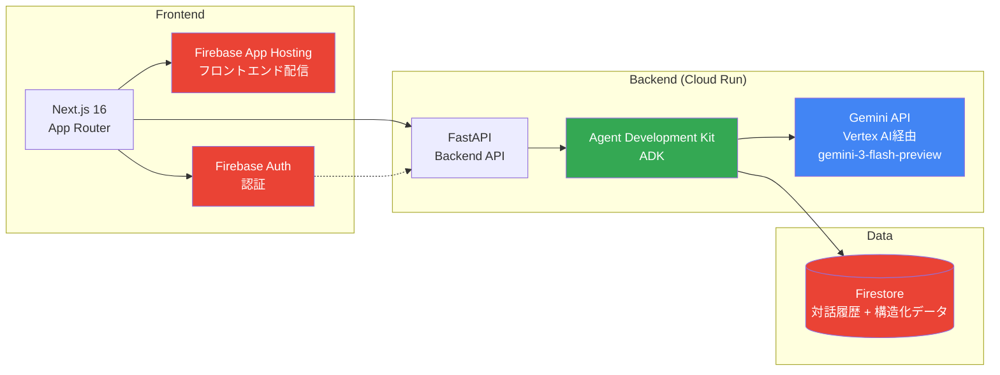
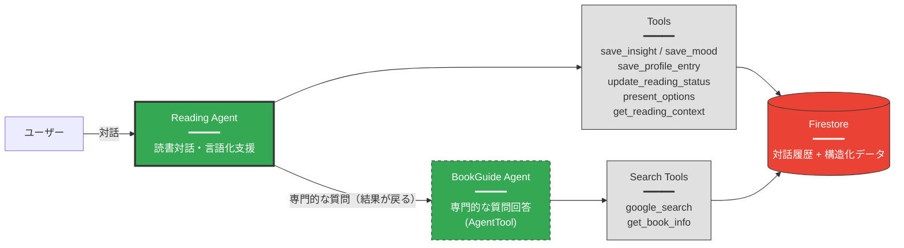

## 5. システムアーキテクチャ
### 5-1. 全体アーキテクチャ

### アーキテクチャの説明

フロントエンドはNext.js 16 (App Router)で、Firebase App Hostingから配信しています。認証はFirebase Authで、APIリクエストには認証トークンを付けています。

バックエンドはCloud Run上のFastAPIです。Agent Development Kit (ADK)でエージェントの実行フローやツール呼び出し、セッション管理を行い、Gemini API（Vertex AI経由）で自然言語の理解・生成をしています。

データはFirestoreに保存しています。対話履歴（messagesコレクション）と構造化データ（読書記録、Insight、プロファイル）を同じDBで管理していて、過去の対話をいつでも振り返れるようにしました。

---

### 5-2. Reading Agent アーキテクチャ

### Reading Agent の説明

Reading Agentがこのアプリの主役です。ユーザーと対話しながら読書体験を掘り下げて、気づきや学びを言葉にしていきます。

主な機能:
- 読書の前・途中・後で対話し、感想や気づきを引き出す
- `save_insight` — 対話から出てきた気づきを自動保存
- `save_mood` — 読書前後の心境変化を5項目のメトリクスで記録
- `save_profile_entry` — ユーザーの興味・価値観をプロファイルに蓄積
- `present_options` — 選択肢を出して会話を進める「guidedモード」

BookGuide Agent（AgentToolパターン）:
- 概念の解説、時代背景、著者情報といった専門的な質問を処理するサブエージェント
- `google_search` でWeb検索、`get_book_info` で書籍情報を取って回答を補強
- AgentToolとして登録しているので、結果はReading Agentに戻る（制御移譲ではない）
- Reading Agentが対話の主導権を持ったまま、専門知識を引き出せる

データ保存:
- 対話はすべて `messages` コレクションに保存
- Insight、Mood、プロファイルは `readings`, `insights`, `moods`, `profileHistory` に構造化データとして保存

その他のエージェント:
読書の対話以外の場面では別のAgentを作成しています。各Agentは一部のツールを共有しています
- **Onboarding Agent** — 初回プロファイル作成。ユーザーの目標・興味・読みたい本をヒアリング
- **Mentor Agent** — 週次・月次の振り返り。過去の活動をもとに励ましやアドバイスを返す
- **Report Agent** — 対話履歴からレポートを生成し、アクションプランを保存

---

### 主要技術スタック

| レイヤー | 技術 |
|---------|------|
| AI Framework | Agent Development Kit (ADK) + google-genai SDK |
| LLM | Gemini API (`gemini-3-flash-preview`) - Vertex AI経由 |
| Backend | Python 3.12+ + FastAPI |
| Frontend | Next.js 16 (App Router) + TypeScript + Tailwind CSS 4 |
| Hosting | Firebase App Hosting (Frontend) + Cloud Run (Backend) |
| Database | Firestore (対話履歴 + 構造化データ) |
| Auth | Firebase Auth |
| Speech | Web Speech API (音声入力) |
| Streaming | Server-Sent Events (SSE) |

---
