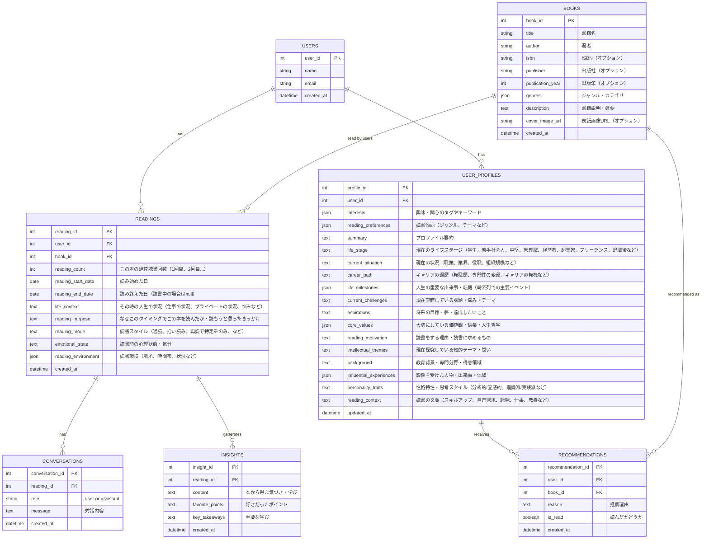

### *Knowva (ノヴァ)** | "Know" (知る) と "Nova" (新星) の造語。未知の知識との出会い。

「本との出会い（📚読書の感想の言語化を手伝う→読書ログ→自分のProfile/Situationと掛け合わせて「思想」の蓄積）→「思想のバージョンアップ」」をコアとし、「ゴール設定」はヘビーユーザー向けのオプション機能、「コミュニティ」は将来的な拡張機能と位置づけ

**MVPのゴール:**

ユーザーが読んだ本の「感想や学び」を対話的に言語化し、それに基づいて自分の読書傾向（プロファイル）を蓄積・可視化し、AIが次に読むべき本を推薦する。読書体験を深め、次の読書につなげる好循環を生み出すAIエージェントアプリ。

#### AIエージェントの種類と役割
1. 読書の感想や学び・本のどこが好きなのかの言語化をサポートするエージェント
1-1. ユーザーのプロファイルを更新する
2. ユーザープロファイルを基に、適切な本を推薦するエージェント

#### MVP主要要件

| No. | 機能名 | 機能概要 |
| :-: | :--- | :--- |
| 1 | **ユーザー登録・ログイン** | メールアドレスとパスワードで基本的な認証を行う。 |
| 2 | **読書記録の追加** | 読んだ本の「タイトル」を入力する（手動またはAPI検索）。 |
| 3 | **音声入力対応（Speech to Text）** | 読書中や読後に、音声で感想・気づきを記録できる。音声認識APIを使用してテキスト化し、対話履歴や学びとして保存する。リアルタイム文字起こしで確認しながら記録可能。 |
| 4 | **AIとの対話的な振り返り** | 読んだ本について、AIエージェントが質問を投げかけ、ユーザーが答える形式で学びや感想を深堀りする。テキスト入力と音声入力の両方に対応。 |
| 5 | **学びの言語化と記録** | AIとの対話を通じて整理された「気づき」「学び」「好きなポイント」をテキストとして自動保存する。 |
| 6 | **ユーザープロファイル更新** | 記録された読書データから、ユーザーの興味・関心・読書傾向を自動で抽出・更新する。 |
| 7 | **読書履歴の表示** | 過去に読んだ本の一覧と、それぞれの学びの要約を表示する。 |
| 8 | **AIによる本の推薦** | ユーザープロファイルを基に、次に読むべき本をAIが3〜5冊提案する。 |

#### MVP開発のアクションプラン（タスクリスト）

1.  **設計フェーズ (1-2日)**
    *   [ ] 上記要件に基づいた画面ワイヤーフレームを作成する。
    *   [ ] データ構造を設計する（後述のデータ構造参照）。
    *   [ ] 技術スタック（言語、フレームワーク、DB、LLM API）を選定する。
    *   [ ] AIエージェントの対話フローとプロンプト設計を行う。
2.  **開発フェーズ (5-7日)**
    *   [ ] ユーザー認証機能とDBのセットアップを行う。
    *   [ ] 読書記録・対話履歴・プロファイルのデータ保存・表示機能（CRUD）を実装する。
    *   [ ] Speech to Text API（例: OpenAI Whisper API、Google Speech-to-Text、Web Speech API）を選定・実装する。
    *   [ ] 音声入力UI（録音ボタン、リアルタイム文字起こし表示）を実装する。
    *   [ ] LLM API（例: OpenAI API）と連携し、「対話的振り返り」「学びの抽出」「プロファイル更新」「本推薦」のプロンプトを設計・実装する。
    *   [ ] 対話UI（チャット形式、音声/テキスト切替）を実装する。
3.  **テスト・デプロイフェーズ (1-2日)**
    *   [ ] 全体の動作確認とバグ修正を行う。
    *   [ ] テスト環境にデプロイし、関係者で実際に使ってみる。

### データ構造

### コアバリュー（仮説）

読書の経験を蓄積できる

### ユーザージャーニー
0. 現在のユーザーの情報（悩みとか）を入力しておく
1. 読む本を登録
2. 読書中にユーザーが情報をインプット（音声）。AIエージェントが話を引き出してもOK
3. 読み終わった後に、人生観の変化や軽い感想を記録
4. 初読書として保存される。ユーザープロファイルに変化が生じる

将来的にテキストのみの出力ではなく、アート（例：映像化、漫画）をできるとよい。
イメージ: https://rhizomatiks.com/